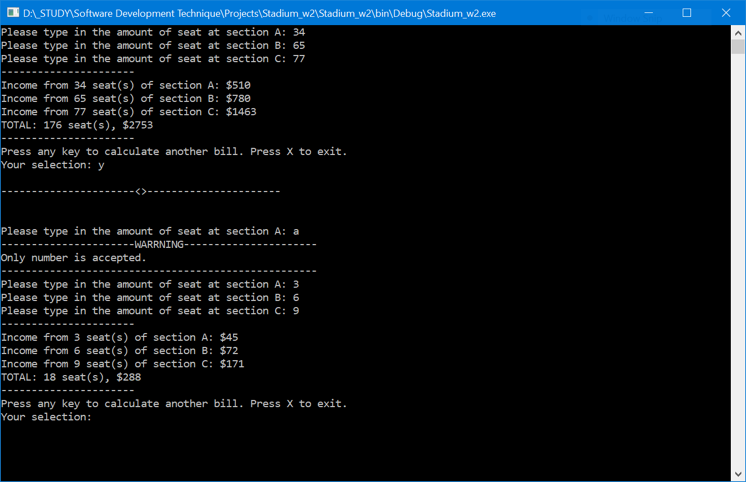

A C# console program that allow user to buy tickets at a stadium.
The stadium has three diffrent ticket types with diffrent prices. User only need to type in how many ticket of each type they want to buy, the program will calculate the total price and tax.

All the in correct input from user were handled to make sure the program runs the way it's designed.

